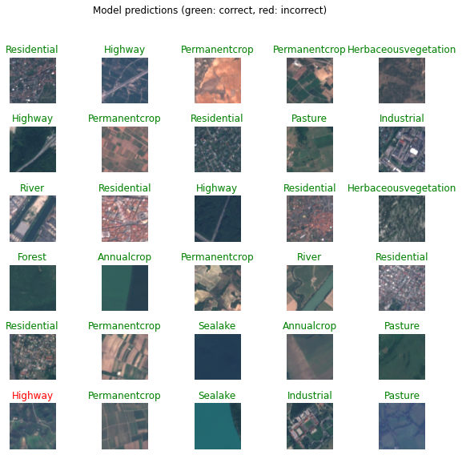

# Satellite Image Classification

Reference: tensorflow.org

## Context: 

### Land-Use-and-Land-Cover-Classification

This work adresses the use of AI in satellite image classification. Recent breakthroughs in deep learning have created novel artificial neural networks capable of learning from examples to predict the future. In the field of image classification, Convolutional neural network can be considered one of the most popular type of architecture used for analyzing visual imagery.

## Objective: 

This script aims at classifying land use and land cover with Sentinel-2 images with the help of CNNs.

## Dataset: 

The network will use a novel dataset based on Sentinel-2 satellite images covering 13 spectral bands and consisting out of 10 classes with in total 27,000 labeled and geo-referenced images. The images measure 64x64 pixels. Each class contains 2,000 to 3,000 image. In order to facilitate colaboratory, I uploaded the dataset on the Google Cloud Storage and made it public. In consequence, anyone with internet access can freely use this notebook to train the network on their own device and make changes if necessary.

